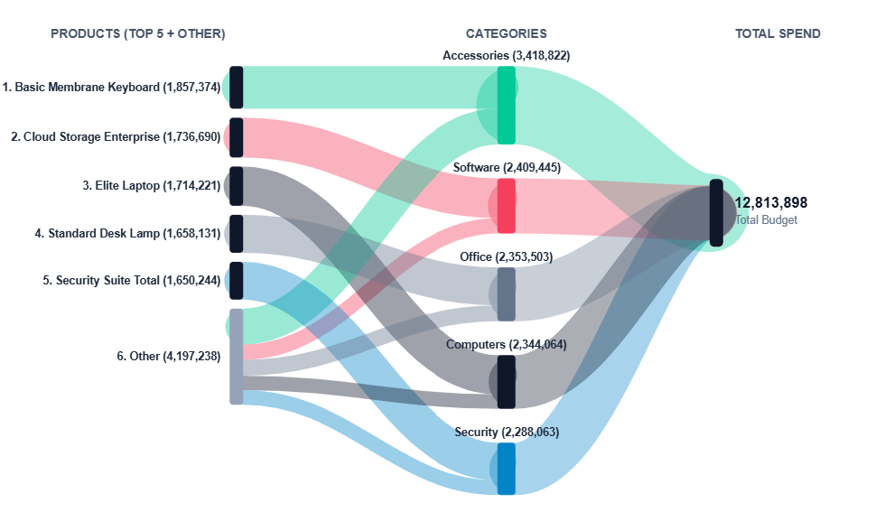
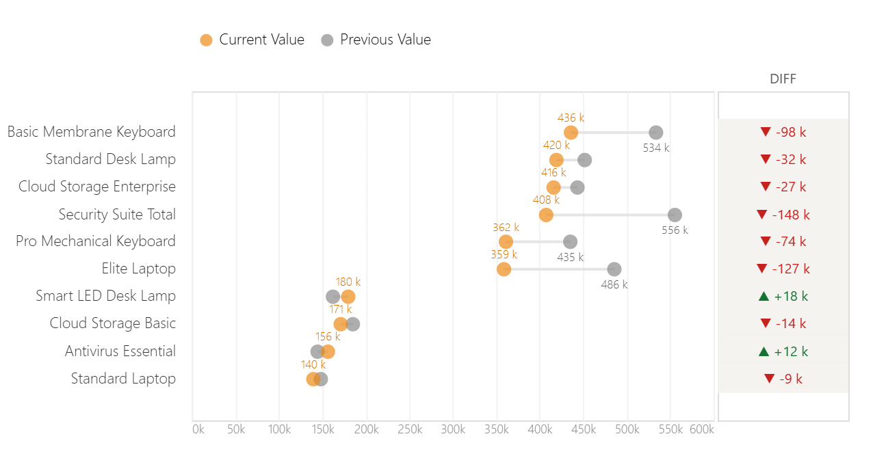
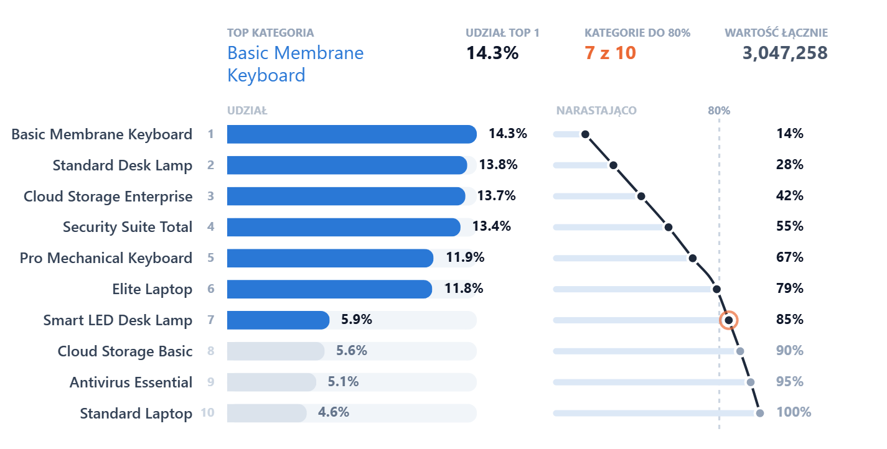

<div align="center">

# Deneb Visuals for Power BI

**Production-ready Deneb templates (Vega & Vega-Lite) for Power BI**

Custom visuals you can import in a few minutes. Each one comes with a preview, a field mapping and a customization guide.

[](https://powerbi.microsoft.com/)
[](https://deneb-viz.github.io/)
[](https://vega.github.io/vega-lite/)
[](LICENSE)

[Website](https://easyanalizy.pl/useful-resources/deneb-templates/) · [Instagram](https://www.instagram.com/easy_analizy/)

</div>

---

## 📊 Template Gallery

| Preview | Template | Grammar | Highlights |
|:---:|---|:---:|---|
|  | **[3-Stage Sankey Flow Chart](flow-charts/3-stage-sankey/)**<br>Spend allocation across three levels | Vega | Dynamic Top N ranking · automatic field name detection · zero-overlap layout |
|  | **[Dumbbell Chart](comparison-charts/dumbbell-chart/)**<br>Before vs. after, target vs. actual | Vega-Lite | Quick setup · clear gap highlighting |
|  | **[Pareto Chart](ranking-charts/pareto-chart/)**<br>80/20 analysis with a cumulative % line | Vega-Lite | Plug-and-play JSON · interactive · step-by-step customization |

### 🚧 Coming Soon

| Template | Status |
|---|:---:|
| Radial Bar Chart with KPI Center | 🔜 In progress |
| Waterfall Chart | 🔜 In progress |
| Calendar Heatmap | 🔜 Planned |
| Bump Chart | 🔜 Planned |

> ⭐ **Star this repo** to get notified when new templates are released.

---

## 📁 Repository Structure

```
deneb-visuals/
├── flow-charts/
│   └── 3-stage-sankey/
├── comparison-charts/
│   └── dumbbell-chart/
├── ranking-charts/
│   └── pareto-chart/
├── LICENSE
└── README.md
```

Each template folder contains:

| File | Description |
|---|---|
| `template.json` | Deneb template, ready to import |
| `spec.json` | Raw Vega / Vega-Lite specification |
| `preview.png` | Screenshot of the visual |
| `README.md` | Required fields, DAX measures and customization tips |

---

## 🚀 How to Use

1. In Power BI Desktop, get the **Deneb** visual from AppSource (*Get more visuals → search "Deneb"*).
2. Add the Deneb visual to your report page.
3. Drag the required fields (listed in each template's README) into **Values**.
4. Open the visual menu **(…) → Edit**.
5. Choose **Import template** and select the `template.json` file.
6. Map your fields to the template placeholders, then click **Create**.
7. Adjust colors, fonts and labels in the **Config** tab to match your report theme.

> 💡 **Tip:** If you prefer to paste the code yourself, create an empty Vega or Vega-Lite spec in Deneb and replace it with the contents of `spec.json`.

---

## ✅ Requirements

- Power BI Desktop (latest version recommended)
- [Deneb](https://deneb-viz.github.io/) custom visual, v1.6 or newer
- Basic knowledge of Power BI data modeling

---

## 📚 Tutorials

Step-by-step guides for every template are on the website:

- [How to Build a Sleek 3-Stage Sankey Flow Chart in Power BI Using Deneb (Vega)](https://easyanalizy.pl/useful-resources/deneb-templates/how-to-build-a-sleek-3-stage-sankey-flow-chart-in-power-bi-using-deneb-vega/)
- [How to Build an Advanced Power BI Dumbbell Chart in Minutes](https://easyanalizy.pl/useful-resources/deneb-templates/how-to-build-an-advanced-power-bi-dumbbell-chart-in-minutes-%F0%9F%9A%80/)
- [How to Build an Interactive Vega-Lite Pareto Chart](https://easyanalizy.pl/useful-resources/deneb-templates/how-to-build-an-interactive-vega-lite-pareto-chart-free-plug-and-play-template-%F0%9F%93%8A/)

---

## 🤝 Feedback & Contributions

Found a bug or have an idea for a new chart? [Open an issue](../../issues). Suggestions are always welcome.

---

## 📄 License

Released under the [MIT License](LICENSE). You are free to use these templates in personal and commercial reports.

---

<div align="center">

Created by **Paulina** · [Easy Analizy](https://easyanalizy.pl)

</div>
